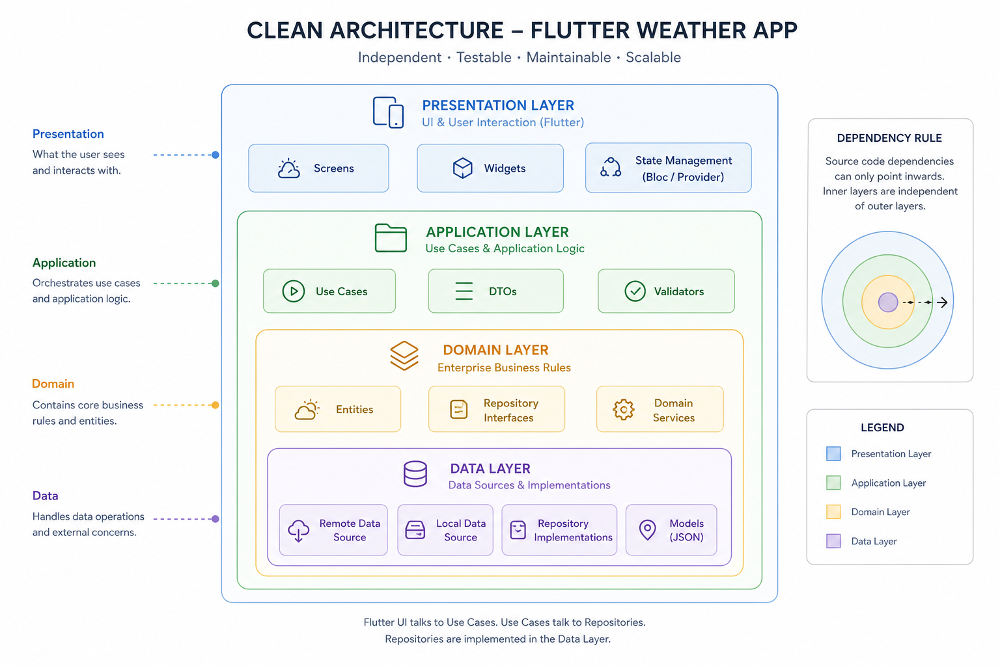

# Architecture Sketch

Weather Flags gates a Flutter weather dashboard with an **on-device feature-flag platform**. Config is loaded from bundled JSON (swappable to a remote Retrofit endpoint); weather from Open-Meteo; flags evaluated locally by a pure-Dart `FlagEvaluator`.

## Layer diagram



```
┌──────────────────────────────────────────────────────────────────────────┐
│  PRESENTATION                                                            │
│  WeatherDashboardPage, FeatureGate, ConfigDebugPanel, GoRouter           │
│  lib/features/*/presentation/  +  lib/core/widgets/                      │
└───────────────────────────────┬──────────────────────────────────────────┘
                                │ reads Bloc state / dispatches events
┌───────────────────────────────▼──────────────────────────────────────────┐
│  APPLICATION                                                             │
│  RemoteConfigBloc, WeatherBloc  →  use cases (GetRemoteConfig, etc.)     │
└───────────────────────────────┬──────────────────────────────────────────┘
                                │ calls
┌───────────────────────────────▼──────────────────────────────────────────┐
│  DOMAIN                                                                  │
│  RemoteConfig, FeatureFlag, FlagEvaluation, WeatherBundle                │
│  FlagEvaluator (pure Dart)  |  repository interfaces                     │
└───────────────────────────────▲──────────────────────────────────────────┘
                                │ implements
┌───────────────────────────────┴──────────────────────────────────────────┐
│  DATA                                                                      │
│  RemoteConfigRepositoryImpl (in-memory + broadcast stream)                 │
│  WeatherRepositoryImpl (Retrofit → Open-Meteo)                             │
│  DTOs, mappers, assets/config/*.json                                       │
└────────────────────────────────────────────────────────────────────────────┘

         core/  —  GetIt DI, GoRouter, theme, Failure, location
```

**Dependency rule:** `presentation → application → domain ← data`. Domain has no Flutter, DTO, or Bloc imports.

| Layer | Responsibility |
|-------|----------------|
| **Presentation** | UI; `FeatureGate` / `FlagVariant` read `RemoteConfigBloc` evaluations |
| **Application** | Blocs orchestrate use cases; propagate `Either<Failure, T>` |
| **Domain** | Entities, `FlagEvaluator`, repository contracts |
| **Data** | JSON assets, Retrofit clients, repository implementations |

## Flag evaluation pipeline

```
  Config JSON  ──►  RemoteConfigRepository  ──►  broadcast stream
                              │
                              ▼
                    RemoteConfigBloc (userId + active config)
                              │
              ┌───────────────┴───────────────┐
              ▼                               ▼
       FeatureGate widget              GoRouter redirect
              │                               │
              └───────────►  FlagEvaluator.evaluate(flag, userId)
                                      │
                    ┌─────────────────┼─────────────────┐
                    ▼                 ▼                 ▼
              kill-switch?      enabled?      bucket < rollout%?
              (strict first)    (second)            (third)
                    │                 │                 │
                    └─────────────────┴─────────────────┘
                                      ▼
                            FlagEvaluation
                     (result, bucket, reason, variant)
```

### Single user + flag (sequence)

```
userId="user_87", flagKey="air_quality_card", config_a (30% rollout)

1. hash input  =  "user_87:air_quality_card"
2. FNV-1a 32-bit  →  integer hash
3. bucket       =  hash % 100   (e.g. 17)
4. killSwitch?  →  no  →  continue
5. enabled?     →  yes →  continue
6. 17 < 30?     →  yes →  result = true, reason = "bucket 17 < 30%, included"
7. FeatureGate renders child; evaluation table shows bucket 17
```

Same inputs always produce the same bucket (tested: 1 000 repeated calls). No network at evaluation time.

## Key decisions

1. **On-device evaluation** — explainability and offline resilience; no per-widget network call. Trade-off: no instant global override without a config push (mitigated by kill-switch + config stream).

2. **Mocked config with a real Retrofit seam** — `assets/config/*.json` today; `RemoteConfigRemoteSource` is a one-line DI swap to a real endpoint. Presentation and `FlagEvaluator` unchanged.

3. **Deterministic FNV-1a bucketing** — `hash(userId:flagKey) % 100`, not random. Stable across restarts and devices; testable without a backend assignment service. Per-flag salt via `flagKey` avoids one bucket deciding all flags.

4. **Strict kill-switch precedence** — evaluated before `enabled` and rollout %. Prevents a mis-set rollout from exposing a flag that ops has killed (incident guardrail).

5. **`FeatureGate` as the single gating primitive** — adding a feature is a config entry + one widget wrap (+ optional route redirect). Inverse cleanup path when a flag graduates.

6. **Four-layer Clean Architecture** — `application/` holds Blocs separate from `presentation/` so domain rules and orchestration stay testable without widget trees.

7. **Fake repository at the DI boundary** — `FakeWeatherRepository` returns canned `WeatherBundle` fixtures so UI is runnable before Open-Meteo; swap to `WeatherRepositoryImpl` in GetIt without touching widgets.

8. **`Either<Failure, T>`** — repositories return `fpdart` Either; failures are typed (`NetworkFailure`, `locationPermissionDenied`, etc.) and mapped in the data layer, not thrown across boundaries.

See [CONVENTIONS.md](CONVENTIONS.md) for package and naming standards.
